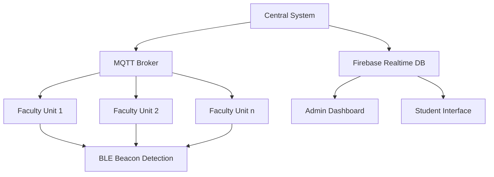
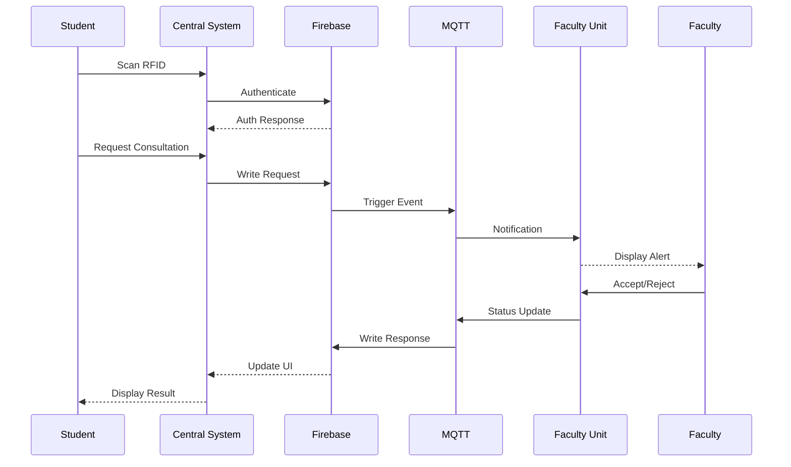

# ConsultEase System Architecture

## Overview

ConsultEase is a dual-hardware system designed to facilitate student-faculty consultations through real-time status tracking and RFID authentication. The system consists of a Raspberry Pi-based central system and multiple ESP32-based faculty units.

## Component Diagram



## Data Flow



## Workflow Descriptions

### UI Flow (Central System - Student Interaction)

```
+-----------------------+      +---------------------+      +-----------------------+
| Start (Application)   | ---> | AuthDialog          | ---> | FacultyDashboard      |
|                       |      | (Scan RFID/Simulate)|      | (Display Faculty List)|
+-----------------------+      +---------+-----------+      +-----------+-----------+
                                         | Accepted                  | Select Faculty
                                         |                           | & Enter Message
                                         v                           v
                                +--------+--------+          +-------+--------+
                                | (Load Dashboard)|          | Submit Request |
                                +-----------------+          +----------------+
                                         | Rejected/Cancelled        | MQTT Publish
                                         v                           v
                                +--------+--------+          +-------+--------+
                                | Close Application |          | Show Confirmation|
                                +-----------------+          +----------------+
```
*   Application starts, immediately shows `AuthDialog`.
*   Student scans RFID (or uses simulation).
*   If authentication succeeds (`Accepted`), `AuthDialog` closes, `MainWindow` loads `FacultyDashboard`.
*   `FacultyDashboard` fetches and displays faculty list/status.
*   Student selects faculty, enters message, clicks "Submit Request".
*   Request is published via MQTT.
*   Confirmation message is shown (e.g., in notification area or dialog).
*   If authentication fails (`Rejected` or Cancelled), `AuthDialog` closes, `MainWindow` closes.

*(Note: Admin Panel access is currently not integrated into this primary student flow).*

### Data Communication Flow (Core Loop)

1.  **Faculty Presence Update:**
    *   `Faculty Unit (ESP32)` periodically scans for `Faculty BLE Beacon`.
    *   `Faculty Unit` determines presence (`Present`/`Unavailable`).
    *   If status changed since last publish:
        *   `Faculty Unit` -> `MQTT Broker` (Topic: `consultease/faculty/{id}/status`, Payload: `"Present"` or `"Unavailable"`, Retained: `true`)
    *   `Central System (RPi)` subscribes to `consultease/faculty/+/status`.
    *   `MQTT Broker` -> `Central System`.
    *   `Central System` updates `FacultyDashboard` UI (status column).

2.  **Student Consultation Request:**
    *   `Student` interacts with `Central System UI` (`FacultyDashboard`).
    *   `Student` selects faculty, enters message, clicks "Submit".
    *   `Central System` -> `MQTT Broker` (Topic: `consultease/requests/new`, Payload: `{"student_id": "...", "faculty_id": "...", "request_text": "...", "timestamp": "..."}`)
    *   *(Optional: `Central System` -> `Firebase` (Log request to `requests` collection))*
    *   `Faculty Unit` subscribes to `consultease/requests/new`.
    *   `MQTT Broker` -> `Faculty Unit`.
    *   `Faculty Unit` parses JSON payload.
    *   `Faculty Unit` updates `TFT Display` (`DisplayManager::show_request`).

### Admin Workflow (Faculty Management)

```
+---------------------+      +---------------------+      +---------------------+
| FacultyDashboard    | ---> | (Admin Button?)     | ---> | AdminPanel          |
| (or Main Window)    |      | (Future Auth Check) |      | (Display Faculty List)|
+---------------------+      +---------------------+      +----------+----------+
                                                                     |
                                                                     v Action (Add/Edit/Delete)
+---------------------+      +---------------------+      +----------+----------+
| Refresh Table       | <--- | Firebase DB         | <--- | FirebaseClient      |
| (Reload Data)       |      | (Data Changed)      |      | (Perform Operation) |
+---------------------+      +----------+----------+      +----------+----------+
                                         ^                           | Dialog (if Add/Edit)
                                         |                           v
                                         +---------------------------+
```
*   User accesses `AdminPanel` (Mechanism TBD, e.g., button on `MainWindow` or `FacultyDashboard`, requires future authentication).
*   `AdminPanel` loads faculty list from `Firebase` via `FirebaseClient` and displays it in a table.
*   User clicks "Add", "Edit", or "Delete".
    *   **Add/Edit:** `FacultyDialog` opens. User enters/modifies data and clicks "OK".
    *   **Delete:** Confirmation dialog appears. User confirms.
*   `AdminPanel` calls the appropriate `FirebaseClient` method (`add_faculty`, `update_faculty`, `delete_faculty`) with the data (or ID for delete).
*   `FirebaseClient` performs the operation on the `Firebase` `faculty` collection.
*   `AdminPanel` calls `refresh_faculty_data()` (or `_load_faculty_data()`).
*   `AdminPanel` re-fetches the complete faculty list from `Firebase` via `FirebaseClient`.
*   `AdminPanel` updates the table view with the refreshed data.


## System Components

### 1. Central System (Raspberry Pi)

The central system serves as the main interface for students and administrators. It handles authentication, displays faculty status, and manages consultation requests.

#### Key Components:

- **RFID Authentication Module**: Interfaces with PN532 RFID reader to authenticate users
- **PyQt6 UI**: Touch-optimized interface for 10.1" touchscreen
- **Firebase Client**: Handles database operations and authentication
- **MQTT Client**: Communicates with faculty units
- **Circuit Breaker**: Handles network failures gracefully

#### Architecture Pattern:

The central system follows a Model-View-Controller (MVC) pattern:
- **Model**: Firebase client and data structures
- **View**: PyQt6 UI components
- **Controller**: Main application logic

### 2. Faculty Unit (ESP32)

Faculty units are deployed in faculty offices to display status and receive consultation requests. They detect faculty presence using BLE and provide manual status controls.

#### Key Components:

- **BLE Scanner**: Detects faculty presence via BLE beacons
- **OLED Display**: Shows status and consultation requests
- **Status LEDs**: Visual indicators for availability
- **Control Buttons**: Manual status control
- **MQTT Client**: Communicates with central system
- **Firebase Client**: Updates status in database

#### Architecture Pattern:

The faculty unit follows an Event-Driven architecture:
- **Event Sources**: BLE detection, button presses, MQTT messages
- **Event Handlers**: Status updates, display changes
- **State Machine**: Manages faculty status transitions

### 3. Firebase Realtime Database

Firebase serves as the central data store and authentication provider. It enables real-time updates across all devices and provides offline capabilities.

#### Data Model:

```
consultease-prod/
├── users/
│   ├── {user_id}/
│   │   ├── name: string
│   │   ├── email: string
│   │   ├── department: string
│   │   ├── roles: {student: boolean, faculty: boolean, admin: boolean}
│   │   └── rfid_tag: string
├── faculty/
│   ├── {faculty_id}/
│   │   ├── name: string
│   │   ├── department: string
│   │   ├── status: "available" | "busy" | "away"
│   │   ├── presence: "present" | "absent"
│   │   ├── last_seen: timestamp
│   │   └── requests/
│   │       └── {request_id}/
│   │           ├── student_id: string
│   │           ├── topic: string
│   │           ├── status: "pending" | "accepted" | "rejected" | "completed"
│   │           └── timestamp: timestamp
├── sessions/
│   └── {session_id}/
│       ├── student_id: string
│       ├── faculty_id: string
│       ├── start_time: timestamp
│       ├── end_time: timestamp
│       └── topic: string
└── admin_logs/
    └── {log_id}/
        ├── user_id: string
        ├── action: string
        ├── timestamp: timestamp
        └── details: object
```

#### Data Access Patterns:

| Operation | Path | Description |
|-----------|------|-------------|
| Faculty Status | `/faculty/{faculty_id}/status` | Real-time status updates |
| Faculty Presence | `/faculty/{faculty_id}/presence` | BLE-detected presence |
| Active Requests | `/faculty/{faculty_id}/requests` | Pending consultation requests |
| User Authentication | `/users/{user_id}` | RFID tag validation |
| Session History | `/sessions` (query by faculty_id) | Historical consultation data |
| System Logs | `/admin_logs` | Administrative audit trail |

#### Security Rules:

```javascript
{
  "rules": {
    "users": {
      ".read": "auth != null",
      ".write": "auth.token.admin === true",
      "$user_id": {
        ".read": "$user_id === auth.uid || auth.token.admin === true",
        ".write": "$user_id === auth.uid || auth.token.admin === true"
      }
    },
    "faculty": {
      ".read": "auth != null",
      ".write": "auth.token.admin === true || auth.token.faculty === true",
      "$faculty_id": {
        ".read": "auth != null",
        ".write": "$faculty_id === auth.uid || auth.token.admin === true"
      }
    },
    "sessions": {
      ".read": "auth != null",
      ".write": "auth.token.admin === true || auth.token.faculty === true"
    },
    "admin_logs": {
      ".read": "auth.token.admin === true",
      ".write": "auth.token.admin === true"
    }
  }
}
```

### 4. MQTT Communication

MQTT provides the real-time communication backbone between the central system and faculty units. It enables low-latency status updates and notifications.

#### Topic Structure:

```
consultease/
├── faculty/{faculty_id}/
│   ├── status → "available|busy|away" (PUB: faculty unit)
│   ├── presence → "present|absent" (PUB: faculty unit)
│   └── requests/
│       ├── new → {"student_id", "topic"} (PUB: central)
│       └── {request_id}/response → "accepted|rejected" (PUB: faculty)
├── system/
│   ├── heartbeat → ping/payload (PUB: all devices)
│   └── alerts → critical system notifications
└── admin/
    ├── broadcast → global commands
    └── config → configuration updates
```

**Payload Requirements:**
- All messages use JSON encoding
- Timestamp in ISO 8601 format
- Message IDs must be UUIDv4

## Security Architecture

### Authentication

- **RFID Authentication**: Physical cards with unique IDs
- **Firebase Authentication**: Role-based access control
- **Admin Access**: Password-protected with elevated privileges

### Data Security

- **Firebase Security Rules**: Restrict access based on user roles
- **MQTT Authentication**: Client ID and optional username/password
- **Offline Data**: Encrypted local storage

### Network Security

- **Firebase**: HTTPS with SSL/TLS
- **MQTT**: Optional TLS encryption
- **Local Network**: Recommended deployment on isolated network

## Failure Handling

### Circuit Breaker Pattern

The system implements the circuit breaker pattern to handle network failures:

1. **Closed State**: Normal operation, all requests pass through
2. **Open State**: After multiple failures, requests are rejected
3. **Half-Open State**: Periodically allows requests to test connectivity

### Offline Operation

Both the central system and faculty units can operate offline:

1. **Central System**: Caches authentication data and recent status
2. **Faculty Units**: Store status locally and sync when connection is restored
3. **Firebase**: Provides offline capabilities with automatic sync

### Recovery Procedures

1. **Firebase Disconnect**:
   - Cache writes locally
   - Retry every 30s
   - Alert after 5 failures

2. **MQTT Broker Down**:
   - Use Firebase as message queue
   - Sync on reconnect

3. **Hardware Failures**:
   - Circuit breaker pattern for hardware comms
   - Graceful degradation for ESP32 units

## Performance Considerations

### Latency Requirements

- **Status Updates**: <500ms end-to-end latency
- **UI Response**: <2s for all user interactions
- **BLE Detection**: <10s to detect presence changes

### Resource Utilization

- **Raspberry Pi**: <50% CPU, <500MB RAM
- **ESP32**: <80% flash, <50% RAM
- **Network**: <1KB/s average bandwidth

### Scalability

The system is designed to support:
- Up to 100 faculty units
- Up to 500 concurrent users
- Up to 1000 consultation requests per day

## Development Considerations

### Technology Stack

- **Central System**: Python 3.11, PyQt6, Firebase Admin SDK
- **Faculty Unit**: Arduino Core, NimBLE, Firebase ESP Client
- **Database**: Firebase Realtime Database
- **Communication**: MQTT (Paho/PubSubClient)

### Testing Strategy

1. **Unit Testing**: Individual components with pytest/ArduinoUnit
2. **Integration Testing**: Component interactions
3. **End-to-End Testing**: Complete workflows
4. **Load Testing**: Performance under high load

### Deployment Strategy

1. **Development**: Local testing environment
2. **Staging**: Limited deployment with test data
3. **Production**: Full deployment with monitoring