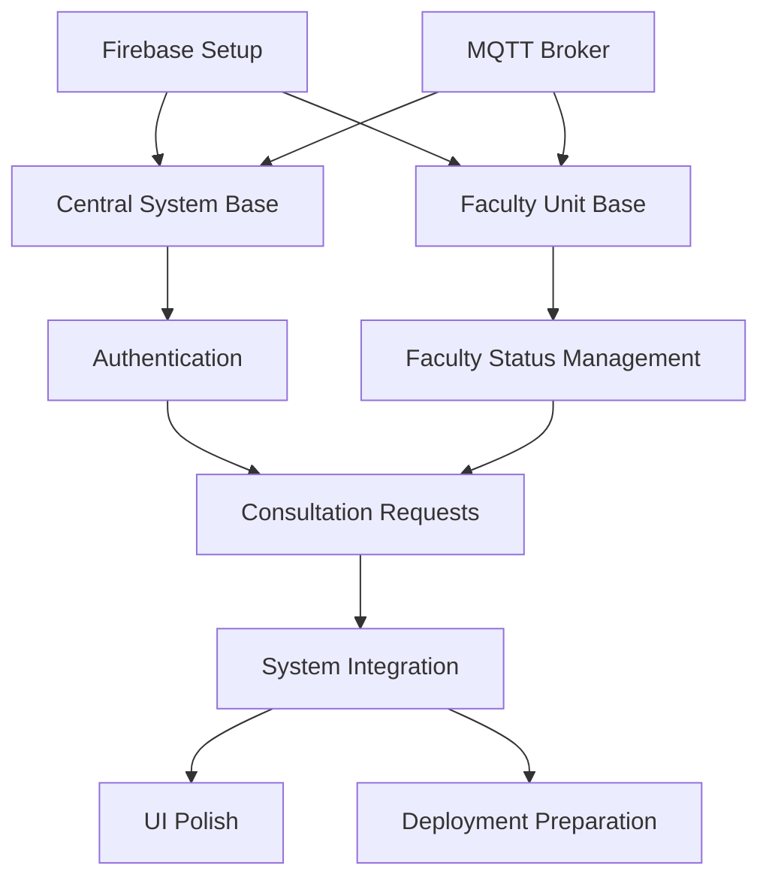

# ConsultEase Implementation Plan

This document outlines the implementation strategy for the ConsultEase project, providing guidance for developers on priorities, dependencies, and development workflow.

## Implementation Priorities

### Phase 1: Core Infrastructure
1. **Firebase Setup**
   - Create Firebase project
   - Configure Realtime Database
   - Set up authentication
   - Implement security rules

2. **MQTT Broker**
   - Install and configure Mosquitto
   - Set up topic structure
   - Test basic pub/sub functionality

3. **Central System Base**
   - Implement PyQt UI framework
   - Create main window structure
   - Set up navigation flow

4. **Faculty Unit Base**
   - Configure ESP32 development environment
   - Implement basic WiFi connectivity
   - Set up display driver

### Phase 2: Core Features
1. **Authentication**
   - RFID reader integration
   - User authentication flow
   - Admin access controls

2. **Faculty Status Management**
   - Status update mechanisms
   - BLE presence detection
   - Status display on faculty units

3. **Consultation Requests**
   - Request creation workflow
   - Request notification system
   - Request acceptance/rejection

### Phase 3: Integration & Polish
1. **System Integration**
   - End-to-end communication testing
   - Failure recovery mechanisms
   - Performance optimization

2. **UI Polish**
   - Responsive design improvements
   - Accessibility features
   - User experience refinements

3. **Deployment Preparation**
   - Documentation finalization
   - Installation scripts
   - User guides

## Component Dependencies

## Development Workflow

### Environment Setup
1. **Central System (Raspberry Pi)**
   - Python 3.11+ environment
   - PyQt6 installation
   - Firebase Admin SDK
   - Paho MQTT client

2. **Faculty Unit (ESP32)**
   - Arduino IDE with ESP32 board support
   - Required libraries:
     - WiFi
     - PubSubClient
     - ArduinoJson
     - NimBLE-Arduino
     - Firebase-ESP-Client
     - Display driver (SSD1306, etc.)

### Git Workflow
1. **Branch Structure**
   - `main`: Production-ready code
   - `develop`: Integration branch
   - Feature branches: `feature/feature-name`
   - Bug fixes: `fix/bug-description`

2. **Commit Guidelines**
   - Use descriptive commit messages
   - Reference issue numbers
   - Include component prefix (e.g., `[Central]`, `[Faculty]`, `[Docs]`)

3. **Pull Request Process**
   - Create PR from feature branch to develop
   - Require code review
   - Pass automated tests
   - Merge to develop

### Testing Strategy

#### Unit Testing
- **Central System**: pytest for Python components
- **Faculty Unit**: ArduinoUnit for C++ components

#### Integration Testing
- End-to-end communication tests
- Firebase operation tests
- MQTT message flow tests

#### System Testing
- Full workflow testing
- Failure recovery testing
- Performance benchmarking

## Implementation Checklist

### Central System
- [ ] Set up project structure
- [ ] Configure Firebase client
- [ ] Implement MQTT client
- [ ] Create UI components
- [ ] Implement RFID reader interface
- [ ] Develop authentication flow
- [ ] Create faculty dashboard
- [ ] Implement admin panel
- [ ] Add utility functions
- [ ] Configure error handling

### Faculty Unit
- [ ] Set up project structure
- [ ] Configure WiFi connectivity
- [ ] Implement MQTT handler
- [ ] Set up display manager
- [ ] Configure BLE scanner
- [ ] Implement status management
- [ ] Create notification system
- [ ] Add button handlers
- [ ] Configure error handling

## Next Steps

1. **Code Implementation**
   - Create placeholder files as outlined in [PLACEHOLDER_FILES.md](PLACEHOLDER_FILES.md)
   - Implement core functionality in each module
   - Follow the component dependencies chart for development order

2. **Testing**
   - Develop unit tests alongside implementation
   - Set up integration test environment
   - Create system test scenarios

3. **Documentation**
   - Update technical documentation as implementation progresses
   - Create user guides for different user roles
   - Document API interfaces between components

## Handoff to Development

This architecture and structure documentation serves as a handoff to the development team. The next step is to implement the placeholder files and begin developing the core functionality according to the priorities and dependencies outlined in this document.

To begin implementation:
1. Review the [ARCHITECTURE.md](ARCHITECTURE.md) document for detailed specifications
2. Create all placeholder files as outlined in [PLACEHOLDER_FILES.md](PLACEHOLDER_FILES.md)
3. Follow the implementation priorities and component dependencies
4. Use the development workflow guidelines for consistent progress