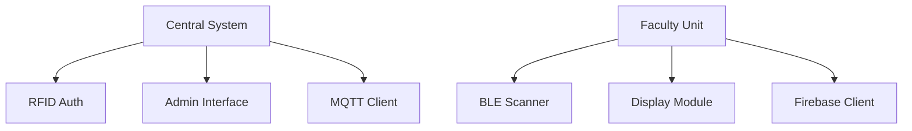

# Active Context
*Last updated: {{DATE}}*

## Current Focus
1. RFID-Firebase auth integration
2. MQTT heartbeat implementation
3. PyQt admin interface prototyping
4. BLE presence detection for ESP32
5. Touchscreen UI optimization (10.1" 1024x600)
6. Squeekboard on-screen keyboard integration

## Recent Decisions
- Switched database from PostgreSQL to Firebase Realtime Database
- Updated Python requirement to 3.11.4 for Bookworm compatibility
- Implemented circuit breaker pattern for hardware communications
- Adopted event-driven architecture for real-time updates
- Optimized UI for 10.1" 1024x600 touchscreen display
- Integrated Squeekboard on-screen keyboard for text inputs

## Implementation Priorities

## Current Challenges
1. **RFID Reader Integration**:
   - Need to handle multiple reader types
   - Implement debounce for rapid scans

2. **Firebase Security**:
   - Role-based access control implementation
   - Offline authentication flow

3. **ESP32 Power Management**:
   - Balance BLE scanning frequency with battery life
   - Implement deep sleep during inactive periods

4. **Touchscreen Optimization**:
   - Ensure UI elements are properly sized for touch interaction
   - Handle on-screen keyboard auto-popup for text inputs
   - Optimize layout for 1024x600 resolution

## Next Steps
- Complete Firebase authentication flow
- Implement admin CRUD operations for faculty management
- Develop BLE beacon detection algorithm
- Create UI mockups for student dashboard
- Test touchscreen interaction on target hardware
- Optimize keyboard handling for different input types

// File version: 1.0-init
