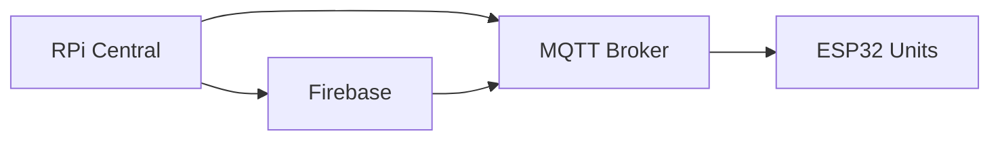
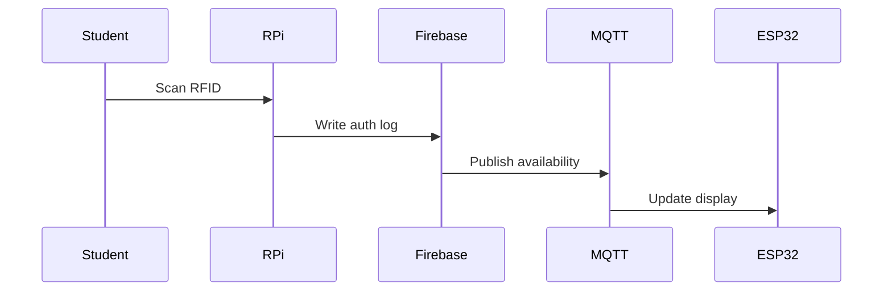

# System Architecture Patterns
*Last updated: {{DATE}}*

## Component Diagram

## Event Flow

## Key Decisions
1. PyQt over Tkinter for touch support
2. MQTT over HTTP for real-time updates
3. Firebase Realtime Database for sync

## Failure Modes
- RFID reader timeout: Auto-retry 3x
- MQTT disconnect: Local cache + resync
- Firebase outage: Fallback to JSON storage

## Recovery Patterns
1. **Firebase Disconnect**:
   - Cache writes locally
   - Retry every 30s
   - Alert after 5 failures

2. **MQTT Broker Down**:
   - Use Firebase as message queue
   - Sync on reconnect

3. **Hardware Failures**:
   - Circuit breaker pattern for hardware comms
   - Graceful degradation for ESP32 units

// File version: 1.1-firebase
